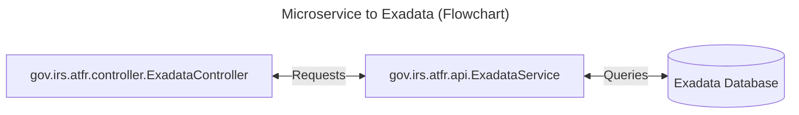
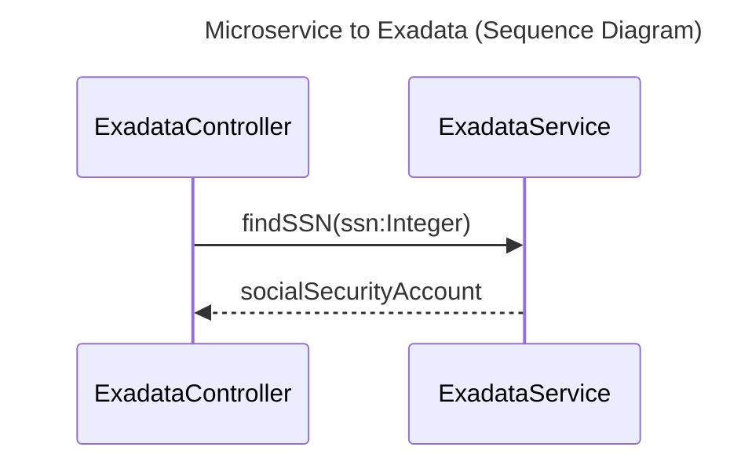
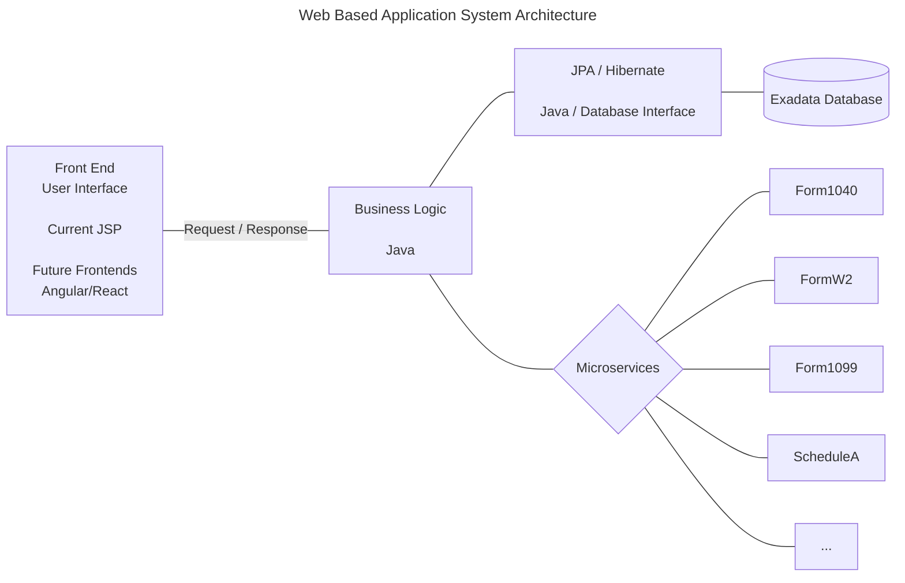

# Migration C to Java - Proof Of Concept (POC)

## Key Migration Patterns

- Converting C structs to Java classes
     - [Technical Details](./details/structVsClass.md)
- Replacing manual memory management with garbage collection
     - Java requires no work, garbage collection is automated
- Transforming fixed arrays to dynamic collections
     - Lists, Maps, Sets, ...
- Moving from procedural to object-oriented design
     - [Technical Details](./details/structVsClass.md)

## POC Approach

- Create a **Controller** that provides an interface to services, e.g.
     - gov.irs.atfr.controller.ExadataController.java
- Create a **Microservice** that sends queries to and from the Exadata Database, e.g.
     - gov.irs.atfr.api.ExadataService.java

#### Flowchart

#### Sequence Diagram

- **C code** - Select simple **C** program
     - Translate C to Java code, e.g. Direct Java translation
     - Maintaining similar structure using Java syntax
     - Create JUnit test for new Java code
     - Compare C to Java - input / output values

- **C code with SQL** - C code with SQL
     - Translate C to Java code, e.g. Direct Java translation
     - Maintaining similar structure using Java syntax
     - Modify Java code to make **Microservice** call
     - Create JUnit test for new Java code
     - Compare C to Java - input / output values

## Major benefits of the migration

- Automatic memory management eliminates memory leaks
- Strong typing catches errors at compile time
- Rich standard library and ecosystem
- Platform independence
- Modern language features (streams, lambdas, generics)

## Key considerations

- Performance differences between C and Java
     - Utilize Spring APIs with performance enhancements
     - [Exadata Database](https://gitlab.com/bobby.estey/wikibob/-/blob/master/docs/database/exadata/README.md)
          - Extreme performance, scalability and availability for data and Artificial Intelligence (AI)
- Need to rewrite build systems and tests
- Potential integration challenges with existing C libraries
